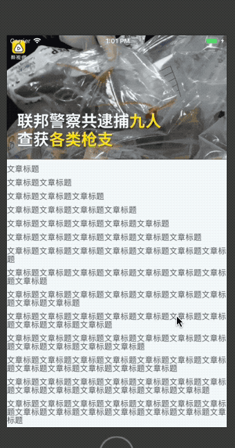

# react-native-sf-video


# 视频播放、支持全屏，自定义大小，进度显示，设备旋转





# 安装
* npm install react-native-sf-video
* npm install react-native-video
* npm install react-native-sf-net
* react-native link react-native-sf-video
* react-native link react-native-video
* npm install react-native-extra-dimensions-android
* react-native link react-native-extra-dimensions-android


# Props
|  parameter  |  type  |  required  |   description  |  default  |
|:-----|:-----|:-----|:-----|:-----|
|title|string|no|视频标题，全屏时才会显示|null|
|allOrientation|bool|no|app是否支持所有旋转|false|
|autoPlay|bool|no|是否自动播放|true|
|resizeMode|string|no|视频内容适配方式（'content', 'cover','stretch'）|'cover'|
|width|number|no|视频宽度|屏幕宽度|
|height|number|no|视频高度|屏幕高度|
|left|number|no|靠左距离|0|
|top|number|no|靠上距离|0|
|barHeight|number|no|进度栏的高度|35|
|hideDuration|number|no|进度栏消失的时间（单位毫秒）|3000|
|progressColor|string|no|进度栏中进度条颜色|'white'|
|progressMinColor|string|no|进度栏隐藏时底部进度条颜色|'rgba(241,90,36,1.0)'|
|containerBackgroundColor|string|no|视屏背景颜色|'black'|
|videoSize|number|no|视频大小（MB为单位），在非wifi下会显示|null|
|onFullScreen|func|no|全屏时回调|null|
|onMinScreen|func|no|小屏时的回调|null|
|onEnd|func|no|视频播放完成时回调|null|
|videoFullSource|number|no|视屏全屏按钮图片|null|
|videoMinSource|number|no|视屏小屏按钮图片|null|
|videoPlaySource|number|no|视屏播放按钮图片|null|
|videoPauseSource|number|no|视屏暂停按钮图片|null|


# 例子
# 使用前需要调用SFNet.registNetListener();来监听网络状态
```
import React, { Component } from 'react';
import {
  Platform,
  StyleSheet,
  Text,
  View,
    Dimensions,
    StatusBar
} from 'react-native';

import SFVideoView from "react-native-sf-video"
var dw = Dimensions.get('window').width;
var dh = Dimensions.get('window').height;
export default class App extends Component {
  constructor(proprs){
    super(proprs);
    this.state={
      source:''
    }
  }
  componentDidMount(){

  }
  render_text = () => {
    items = [];
    for (var i = 0; i < 15; i++){
      var str = '';
      for (var j = 0; j < i+1; j++){
        str += '文章标题'
      }
      items.push(
          <Text key={i} style={{
            color:'rgba(90,90,90,1)',
            fontSize:15,
            marginTop:10
          }}>{str}</Text>
      )
    }
    return items;
  }
  render() {
    return (
      <View style={styles.container}>
        <StatusBar barStyle="light-content" translucent={true}/>
        <SFVideoView
            source={'http://video.pearvideo.com/mp4/short/20170519/cont-1082017-10470584-sd.mp4'}
            title={'视频标题'}
            left={0} top={0} width={dw} autoPlay={true} height={233}/>
        <View style={{
          flex:1
        }}>
          {this.render_text()}
        </View>

      </View>
    );
  }
}

const styles = StyleSheet.create({
  container: {
    flex: 1,
    backgroundColor: '#F5FCFF',
  },


```
